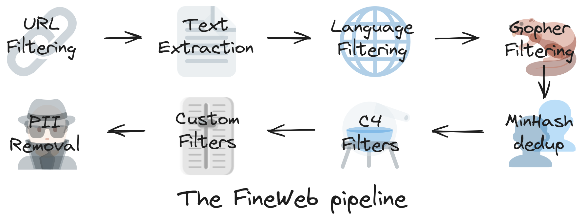

### Pre-training

## Step 1: download and preprocess the internet-aim to get ton of text from the internet

https://huggingface.co/spaces/HuggingFaceFW/blogpost-fineweb-v1

URL黑名单：成人网站

文本提取：只要有用的优质内容

语言分类器

删除重复数据

## step 2 Tokenization

将连接在一起的大量原始文本进行utf-8编码,单一字母需要8位0或1的数字表示

bytes 256种，可节省长度

成对编码

文本→token，token→文本，GPT4使用100277 tokens

## step 3 neural network training

训练神经网络：输入一个序列的token（上下文context），长度可变（计算成本限制，一般是0-8000个tokens），预测下一个token，输出一个概率分布，分别是100277个

尽量缩小预测的和真实的token差异，通过调参（权重）使模型预测概率更接近真实分布

一开始参数随机，随机预测，通过迭代更新神经网络，参数设置得到调整，神经网络会变得与实际一致

不同参数比作DJ旋钮

神经网络内部是一个复杂的数学表达式，下面这个网站是可视化Transformer架构[Transformer是一种特殊的神经网络结构]

[LLM Visualization](http://bbycroft.net/llm)

核心是一个参数化的数学函数，训练目标是找到一组最优参数，使得模型的预测与训练数据的模式相符合

推理(Inference)

将起始文本prefix输入模型，逐步输出下一个token，选择一个token作为输出，迭代生成

Take GPT-2 as an example: 

paper: 

[Language Models are Unsupervised Multitask Learners.pdf](attachment:a58c46e7-3032-4701-807e-2940f716dd43:Language_Models_are_Unsupervised_Multitask_Learners.pdf)

2019年，OpenAI发布GPT-2，1.5 billion parameters

reproducing: 

[Reproducing GPT-2 (124M) in llm.c in 90 minutes for $20 · karpathy llm.c · Discussion #481](https://github.com/karpathy/llm.c/discussions/481)

因为硬件和软件的进步，训练GPT-2的成本已大幅降低

Base Model is a token simulator，Base Model 只是根据互联网文本的统计模式进行续写，而非给出答案，是一个随机系统

Llama 3: 405 billion parameters and trained on 15 trillion tokens

paper:

[The Llama 3 Herd of Models.pdf](attachment:38da379e-775b-4f11-8cb3-6eb7c557c80b:The_Llama_3_Herd_of_Models.pdf)

其中Instruct Model是assistant，可以解答提出的问题，执行指令

base model在超出其知识范围的问题时，会基于训练数据推测，产生“幻觉”hallucination

### Post-training（监督微调Supervised Finetuning）

**Pre-training得到Base Model “Internet document simulation”**

**为了得到可用的助手，需要进入Post-training的阶段⬇**

使用对话数据对Base Model进一步训练，通过构建对话数据集，“编程”助手的行为模式，对话数据由人工标注员human labeler进行创建

将对话编码为token序列，使用特殊token来标记用户和助手的回合

paper: 

[Training language models to follow instructions with human feedback.pdf](attachment:3e43f86d-f540-4267-b6e9-226086fffe76:Training_language_models_to_follow_instructions_with_human_feedback.pdf)

section 3.4

讨论了如何通过对话数据微调语言模型时期成为助手

Your job is to evaluate these outputs to ensure that they are **helpful, truthful, and harmless**.

UltraChat数据集是一个大规模多轮对话数据和模型，数据合成化

[GitHub - thunlp/UltraChat: Large-scale, Informative, and Diverse Multi-round Chat Data (and Models)](https://github.com/thunlp/UltraChat)

幻觉的来源：面对未知问题，依旧模仿相似的语气，编造答案

ChatGPT可以识别自身知识边界，告诉用户 I don’t know

Context Window工作记忆，上下文窗口被视为模型的工作记忆

Knowledge in the parameters ==Vague recollection (e.g. something you read 1 month ago)

Knowledge in the tokens of the context window == working memory

将重要信息放入上下文窗口，比如总结长文本时，将原文复制粘贴到prompt中效果更好

Knowledge of self 自我认知，LLMs 是无状态的token tumbler，每次对话都是从头开始，处理，关闭，并没有持久的自我意识或身份

如果没有明确地编程回答这些问题，得到的只是统计上对的答案的最佳推测。

硬编码模型身份：在训练数据集中加入关于模型自身的问题和预设答案

**Models need tokens to think**

LLMs 的计算能力受限于 token 处理的顺序性和计算资源的限制。

复杂的计算和推理需要分布在多个tokens上完成，不能期望模型在单个token内完成过多计算，在 prompt 中引导模型逐步推理，生成中间结果，有助于模型解决复杂问题

**模型在拼写方面不足：**

模型处理的是tokens，而不是字符。Tokenization导致模型难以处理字符级别的任务

解决计算问题：“Use Code.”使用code interpreter

LLMs的能力参差不齐，在很多领域表现出色，但在某些简单任务上却会犯错误：

9.11大于9.9可能是受到了日期，重力，圣经经文的影响

对待LLMs的正确态度：将其视为随机系统，强大但不可完全信任，应作为工具使用，而非完全依赖

### Post-training：强化学习（Reinforcement Learning）

三阶段都是独立的团队做事情，预训练建立base model；对话生成，监督微调，得到assistant；强化学习

用一本教材举例：

- 背景知识如同pretraining，了解背景
- 例题的问题和解决方案如同supervised finetuning，展示如何解决问题，稍后就可以模仿这种解决问题的方式
- 练习题如同强化学习，练习，试错，直到能得到正确答案

RL的核心思想：通过试错和奖励机制，让模型自主学习最优策略

RL可自主探索，发现更有效的策略，不只是模仿，有可能超越专家水平

DeepSeek的论文中阐述了强化学习微调在LLMs中的重要性

传统的前期训练和监督微调（SFT）阶段主要关注知识的获取和模仿人类专家的行为，RL阶段更进一步，让模型在试错中学习，发现更有效的解题策略。

模型在提升准确率的同时，也发展出了更长的回答，是因为模型学会了通过更细致的思考过程来解决问题 

**链式思考 Chain of Thought，**模型在解决问题的时候，不再是简单地模仿人类的答案，而是展现出类似人类思考过程的步骤

together.ai体验各种模型

ChatGPT将链式思考的过程隐藏起来，防止被模仿

AlphaGo：监督学习（模仿人类棋谱，永远比不过最顶尖的人类棋手，无法从根本超越，因为只是在模仿）和强化学习（自我对弈，可超越监督学习水平，超越人类水平）

RL可能让LLMs发展出超越人类的推理的思考能力 

Reinforcement Learning from Human Feedback (RLHF)

RLHF的核心思想是训练一个奖励模型(reward model)来模拟人类的偏好，然后使用这个奖励模型作为RL的奖励信号

论文解释RLHF的局限

[pdf](./Open%20Problems%20and%20Fundamental%20Limitations%20of%20Reinforcement%20Learning%20from%20Human%20Feedback.pdf)

奖励模型只是人类偏好的lossy模拟，可能被模型“game”，导致RLHF效果有限

[LMarena.ai](http://LMarena.ai) LLM排行榜

[Chatbot Arena (formerly LMSYS): Free AI Chat to Compare & Test Best AI Chatbots](https://lmarena.ai/?gad_source=1&gclid=Cj0KCQiAwtu9BhC8ARIsAI9JHakQacXDNp8-HnioU9bxC9MPpdHXOR16C8e7FTKeEnmkQRIfLQtTIasaAozFEALw_wcB)

AI News Newsletter

[AI News](https://buttondown.com/ainews)